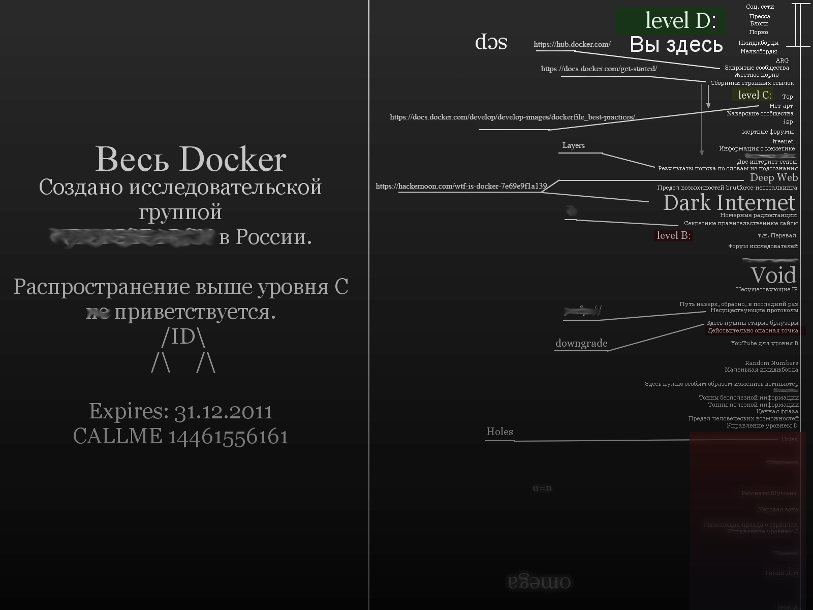

# Карта Docker



# Мотивация

Docker сделан для решения проблем виртуальных машин, а именно:

- Поддержка конфигураций виртуальных машин
- Сложность создания окружения для локальной разработки
- Виртуальные машины дают ощутимый оверхед

# Что дает Docker?

- Легко деплоить, нужна только машина с docker'ом
- Легко построить тестовое окружение
- Нет оверхеда, контейнер живет в обычном процессе Linux

# Как работает Docker

Docker это тонкая прослойка над ядром Linux

Docker использует механизм namespaces ядра Linux, namespaces представляет собой пространства имен в которое входит файловая система, uts, pid's, сети, пользователи, межпроцессное взаимодействие  
Namespaces позволяет создать нам новое пространство со своей сетью, файловой системой, процессами и т.д., которое будет полностью изолированно от других, т.е. мы получим новый процесс со своим pid, который будет выполнять системные вызовы от этого pid, а внутри него могут быть множество других процессов

# [Docker Maxime](https://12factor.net/)

Изучение чего угодно должно начинаться с максим(правила, имеющие предельную степень общности и обязательности), как например [pep-20](https://www.python.org/dev/peps/pep-0020/) и [Дао программирования](https://habr.com/ru/post/229985/).
Поэтому, прежде чем продолжить читать этот текст, нужно ознакомиться с принципами построения распределенных систем.

# `Level D`

## Docker layer

Выполненные команды докера создают свой reed only слой, т.е. слой состояния системы после выполнения команды
Docker использует стратегию cow (copy on write), т.е. при выполнении команды создается r/w слой и работа идет только с ним, при изменении файлов из созданных ранее слоев, файлы копируются в текущий слой и используются вместо базовых, после чего слой становится read only, значит чем меньше слоев и чем меньше они делают, тем меньше образ

Есть слои, есть и кеш, если наш слой не изменился, при билдинге мы будем использовать уже существующий слой из кеша, что ускорит сборку, из этого следует, что команды нужно упорядочить по степени их изменяемости  
Например: Сначала билдим зависимости, а потом копируем код, т.к. код меняется чаще зависимостей 

Слои Docker это мощный инструмент, т.к. мы можем использовать их как кеш и не выполнять команду заново, например это позволяет не билдить зависимости, каждый раз попусту гоняя трафик и время цп

## Минимизация размера и ускорение сборки

Для удобного использования в CI/CD, стараются минимизировать размер образа и использовать кэш, т.к. каждый раз качать образы по 1гб и билдить их с самого начала слишком долго, что усложняет доставку и поддержку, кто хочет ждать по 5 минут, прежде чем запустить e2e или integration тесты, которые еще и упадут и все пойдет по кругу.

Тут все просто, меньше слоев — меньше образ, поэтому чем меньше инструкций и чем лучше они написаны, тем лучше, но так же не стоит забывать про кеш и максимизировать его использование

- Для использования кеша, сначала ставим все нужные зависимости
- Минимизируем последствия установки зависимостей
```Dockerfile
# Для зависимостей нужны либы? Убери за собой.
RUN \
    savedAptMark="$(apt-mark showmanual)"; \ # Запомним важные пакеты установленные "в ручную", добавь сюда свои пакеты, которые нужны в runtime
    apt-get update && \
    apt-get install -y --no-install-recommends gcc libc6-dev; \ # no-install-recommends, только критически важные пакеты
    pip install --no-cache-dir -r requirements.txt; \ # no-cache-dir не сохранять исходники и wheel
    apt-mark auto '.*' > /dev/null; \ # Пометим все пакеты как установленные автоматически
    apt-mark manual $savedAptMark; \ # Пометим важные пакеты, как установленные в ручную
    apt-get purge -y --auto-remove -o APT::AutoRemove::RecommendsImportant=false; \ # Удалим все "auto" пакеты
    rm -rf /var/lib/apt/lists/*; # Удалим кеш apt
```
- Ставим dev зависимости  
Зависимости будут меняться реже чем код, поэтому зачастую будет использоваться кеш, что даст нам скорости при сборке
- Теперь можно копировать код в контейнер 

## [Время](https://habr.com/ru/post/313274/)

Время в Docker идет так же, как и на хост машине, но `time zone` может быть какой угодно и зависит от базового образа, поэтому чтобы наши контейнеры хотя бы работали в одной зоне, лучше ее зафиксировать.

Некоторые базовые образы поддерживают установку `time zone` через задания `ENV TZ=`, как например ubuntu, postgres, перед установкой следует уточнить.

## Environment

Приложение должно конфигурироваться через переменные окружения.

Для гибкости все важные переменные, которые могут меняться в зависимости от окружения не должны быть захардкожены, а должны выставляться через переменные среды, особенно это касается внешних зависимостей, например подключение к базе.

Лучшей практикой будет использование значений по-умолчанию на уровне конфигурации приложения, а не исходного кода и возможность легко заменить их, например с помощью локального env файла.

В случае с работой с docker-copmose приоритет переменных окружения будет таким:

1. Docker compose
2. Shell
3. env_file
4. Dockerfile

Поэтому не стоит хардкодить переменные в docker-compose, а использовать в нем значения по умолчанию, чтобы можно было переопределить переменные удобным способом, например через локальный .env файл.

### Нет 💀

```yaml
version: '3.8'
services:
  test:
    environment: 
      bad: "Сердце защемило"
      db_pass: "qwerty"
```

### Да 💪

```yaml
version: '3.8'
services:
  test:
    environment: 
      super_env: ${SUPER_ENV:-"Душа поет"}
      db_pass: ${DB_PASS:?"Не хардкодь, подумой"}
```

### ARG vs ENV

У `ARG` и `ENV` разные области видимости для контейнера. `ARG` будут видны только в Dockerfile во время сборки и задаются с помощью опции `--build-arg`, т.е. в `ARG` должны быть записаны переменные важные только на этапе сборки.

# `Level C`

## Multi-stage build

Позволяет делить Dockerfile на стадии, которые можно использовать как базовый образ. Это дает возможность минимизировать размер образа и улучшить использование кеша, только уже в виде целых стадий с использованием в CI. Тут используются такие же принципы, как и со слоями docker, только теперь мы работаем с более высокоуровневой сущностью, которая должна отражать едииноответсвенный процесс.

Для того чтобы запустить приложение нам нужно:
- установить зависимости
- собрать код
- протестировать код  
- запустить

В итоге мы имеем несколько последовательных процесса, которые можно выразить в стадиях

Особенно это актуально для компилируемых языков, где конечной стадией является запуск исполнительных файлов и в контейнере должны быть только инструменты для их запуска, без всяких build-util, cmake и т.д.

### Разберем Dockerfile Python приложения

```Dockerfile
# Готовим все что нужно для запуска код
FROM python:3.9.6-slim-buster as common-deps

RUN groupadd --system awesome_user && useradd --no-log-init --shell /bin/false --system --gid awesome_user awesome_user

ENV TZ='Europe/Moscow'

ENV APP_DIR=/app

WORKDIR ${APP_DIR}

COPY ./requirements.txt ${APP_DIR}/requirements.txt
RUN pip install --no-cache-dir -r ${APP_DIR}/requirements.txt

# -------------------- development dependencies and sources --------------------
# Dev стадия удобна для использования в разработке, т.к. позволяет запускать образ без стадий тестировапния и линтига
FROM common-deps as dev

COPY ./requirements-dev.txt ${APP_DIR}/requirements-dev.txt
RUN pip install --no-cache-dir -r ${APP_DIR}/requirements-dev.txt

COPY awesome_app ./awesome_app
COPY ./tests ./tests

COPY mypy.ini ${APP_DIR}/mypy.ini

# -------------------- unit tests and linters --------------------
FROM dev as dev-unittested

RUN pytest ${APP_DIR}/tests/unit
RUN mypy ${APP_DIR}/awesome_app

# -------------------- final image --------------------
# Для зпауска приложения нам нужен только исходный код и установленные зависимости
FROM common-deps as final

# В опции --from можно указать любой другой образ
COPY --from=dev-unittested ${APP_DIR}/awesome_app ./awesome_app

USER awesome_user

EXPOSE 8080

CMD ["python", "-m", "awesome_app"]
```

В итоге получаем протестированное, готовое к запуску проложение без ненужных в проде вещей.

Каждая стадия самостоятельна, мы можем сбилдить образ до нужной нам стадии, например для разработки нам будет достаточно `dev` стадии.

### Multi-stage и CI

Во время разработки иногда приходится запускать много пайплайнов и каждый раз билдить образ заново не очень то и приятно и тут нам помогут наши стадии.

Так как каждая стадия самостоятельна, нужно сохранять каждый образ в registry, т.к. например `final` не содержит `dev` файлов, поэтому для билда `final` нам нужны стадии `dev` и `dev-unittested`.

```yaml
build app images:
  stage: build
  only:
    - branches
  script:
    #  Первой пулим `dev-unittested`, т.к. она самая полная
    - docker pull "$APP_IMAGE_TAG_CURRENT_COMMIT_DEV_UNITTESTED" &> /dev/null || docker pull "$APP_IMAGE_TAG_CURRENT_COMMIT_DEV" &> /dev/null || docker pull "$APP_IMAGE_TAG_MASTER_DEV" &> /dev/null || true
    
    # Билдим `dev` стадию, важную для следующих стадий
    - docker build
      --cache-from "$APP_IMAGE_TAG_CURRENT_COMMIT_DEV_UNITTESTED"
      --cache-from "$APP_IMAGE_TAG_CURRENT_COMMIT_DEV"
      --cache-from "$APP_IMAGE_TAG_MASTER_DEV"
      --tag "$APP_IMAGE_TAG_CURRENT_COMMIT_DEV"
      --target dev
      -f ./Dockerfile .
    - docker push "$APP_IMAGE_TAG_CURRENT_COMMIT_DEV"
    
    # Билдим протестированную версию для integration тестирования
    - docker build
      --cache-from "$APP_IMAGE_TAG_CURRENT_COMMIT_DEV_UNITTESTED"
      --cache-from "$APP_IMAGE_TAG_CURRENT_COMMIT_DEV"
      --tag "$APP_IMAGE_TAG_CURRENT_COMMIT_DEV_UNITTESTED"
      --target dev-unittested
      -f ./Dockerfile .
    - docker push "$APP_IMAGE_TAG_CURRENT_COMMIT_DEV_UNITTESTED"
    
    # Билдим финальную версию для e2e тестирования или использования на стейдже
    - docker build
      --cache-from "$APP_IMAGE_TAG_CURRENT_COMMIT_DEV_UNITTESTED"
      --tag "$APP_IMAGE_TAG_CURRENT_COMMIT"
      --target final
      -f ./Dockerfile .
    - docker push "$APP_IMAGE_TAG_CURRENT_COMMIT"
```


## Про Alpine

Alpine не поддерживает `manylinux1 wheel` и использует `musl` вместо `glibc` (стандартные библиотеки C), а это значит, что некоторые зависимости придется билдить самостоятельно и нет гарантий что `msul` не добавит багов, но если все зависимости `pure` то Alpine будет хорошим выбором.

## Да кто такой `Fixuid` и привилегии

По умолчанию Docker работает от root, очевидно это никому не нужно и лучше проверять загружаемые через pull контейнеры, используют ли они root пользователя. 
Контейнер не должен менять свое состояние согласно [12factor](https://12factor.net/), поэтому лучшей практикой будет использовать read-only права для пользователя в контейнере для работы с данными в контейнере. 
Т.к. в контейнере будет свой пользователь, то файлы которые он будет создавать в монтированном томе будут с привилегиями этого юзера, и мы не сможем получить доступ к этим файлам от локального юзера, что создает неудобства. 
Fixuid позволяет запускать контейнер с нужными правами, т.к. при билде проставятся права либо юзера в контейнере, либо рута, если мы не указали явно, то fixuid поможет дать права запускающего юзеру в контейнере и не поломать права на хост машине
Для локальной работы fixuid не нужен, можно запустить контейнер с передачей UID, а с host машиной пускай разбираются DevOps

## [Безопасность](https://habr.com/ru/company/southbridge/blog/339126/) и [Опасность](https://xakep.ru/2020/12/03/docker-hub-analisys/)

- Чтобы защитить себя от лишних проблем, используем только официальные образы и фиксируем версию образов, в любой момент `latest` версия может оказаться чем угодно и в лучшем случае не работать
- Создавать юзера при сборке контейнера

## ENTRYPOINT VS CMD

Если есть ENTRYPOINT, то все что есть в CMD будет выполняться после него, поэтому CMD может служить для передачи параметров, либо для исполнения действий после ENTRYPOINT

### Почему ENTRYPOINT это плохо

Мы связываем руки людям, которые будут использовать наш образ, т.к. все что будет написано в docker run, попадет в ENTRYPOINT и если мы качаем пол интернета в ENTRYPOINT, а я хочу зайти в sh, то мне будет очень неприятно, а вообще приложение само должно управлять своим состоянием, например делать миграции, поэтому ENTRYPOINT это антипаттерн.

И ни в коем случае нельзя использовать ENTRYPOINT в shell форме, т.к. он запустит CMD в shell форме, даже если он будет в exec.

# `Level B`

## Shell vs Exec

### Shell

Позволяет использовать все преимущества shell'а, пайпы, подстановку переменных среды и прочую магию, короче привычно и удобно, но надо помнить, что shell создает дочерний процесс при выполнении команд.

### Exec

- Заменяет командную оболочку на заданную программу (не запускает новый процесс), теперь никаких пайпов и env (кроме тех что указаны в Dockerfile).
- Устанавливает redirection для выполняемой программы или для текущей оболочки.
- Если заданы только redirection, то redirection влияют на текущую оболочку без выполнения какой-либо программы.

Для нас это значит, что запущенное приложение будет иметь PID 1 и как следствие будет ловить все сигналы из вне, но так как управление находится у программы, то она и должна обрабатывать все сигналы, иначе они будут проигнорированы.  
Так же, т.к. это PID 1, т.е. Init process, то при его завершении будут убиты все дочернии процессы, поэтому с формой exec в наших руках влясть над всем контейнером 
Но с властью приходят и проблемы, осторожно, сейчас начинается уровень `Dark Internet` - [проблема PID 1 zombie reaping](https://habr.com/ru/company/hexlet/blog/248519/).
